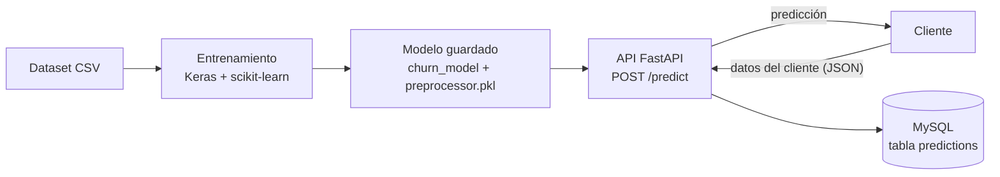

# API de predicción de churn con despliegue en AWS

Sistema de *machine learning* de principio a fin: una red neuronal que predice si un cliente de telecomunicaciones cancelará el servicio, una API que la expone y guarda cada predicción en MySQL, y el despliegue de la API y la base de datos en AWS.

| Aspecto | Detalle |
|---|---|
| **Problema** | Clasificación binaria: ¿el cliente se va o se queda? |
| **Modelo** | Red neuronal densa (Keras) con preprocesamiento de scikit-learn |
| **API** | FastAPI, con validación de datos y documentación automática |
| **Base de datos** | MySQL (local y en Amazon RDS) |
| **Nube** | AWS: instancia EC2 para la API y RDS para la base de datos |

## Arquitectura



En AWS, la API corre en una instancia EC2 y la base de datos es una instancia MySQL de RDS.

## Qué hace

1. **Entrena** una red neuronal con el dataset Telco Customer Churn y guarda el modelo junto con el preprocesador de los datos.
2. **Expone** el modelo en un endpoint `POST /predict`: recibe los datos de un cliente, los valida, los preprocesa y devuelve la probabilidad de que se vaya.
3. **Guarda** en MySQL los datos recibidos, la predicción y la fecha de cada consulta.
4. **Se despliega** en AWS, con las credenciales de la base de datos fuera del código.

## Estado del proyecto

| Componente | Estado |
|---|---|
| Modelo de Keras | Entrenado y guardado en `modelo/` |
| API con el modelo y MySQL (`api/app.py`) | Ejecutada en local |
| API en EC2 conectada a RDS (`api/app_sin_modelo.py`) | Desplegada en AWS, sin el modelo |

En AWS no se pudo instalar TensorFlow: la instancia de la capa gratuita (`t3.micro`) no tiene memoria suficiente. La versión desplegada devuelve una probabilidad fija en lugar de usar el modelo, y sirvió para probar en la nube el recorrido completo de una petición: API en EC2, validación, escritura en RDS y respuesta.

## Resultados del modelo

Evaluación sobre 1.407 clientes que el modelo no usó para aprender:

| Métrica | Valor |
|---|---|
| Accuracy | 0,789 |
| Precisión | 0,604 |
| Recall | 0,599 |
| AUC | 0,823 |

De los 374 clientes que se fueron, el modelo detecta 224.


La pérdida de validación deja de mejorar hacia la época 4 mientras la de entrenamiento sigue bajando: el modelo se sobreajusta pronto. El análisis completo está en [`docs/01_datos_y_modelo.md`](docs/01_datos_y_modelo.md).

## Ejemplo de uso

Petición a `POST /predict`:

```json
{
  "gender": "Male",
  "Partner": "Yes",
  "Dependents": "No",
  "PhoneService": "Yes",
  "MultipleLines": "No",
  "InternetService": "Fiber optic",
  "OnlineSecurity": "No",
  "OnlineBackup": "Yes",
  "DeviceProtection": "No",
  "TechSupport": "No",
  "StreamingTV": "Yes",
  "StreamingMovies": "Yes",
  "Contract": "Month-to-month",
  "PaperlessBilling": "Yes",
  "PaymentMethod": "Electronic check",
  "SeniorCitizen": 0,
  "tenure": 5,
  "MonthlyCharges": 89.85,
  "TotalCharges": 400.00
}
```

Respuesta:

```json
{
  "prediction": 1,
  "probability": 0.7710350155830383
}
```

El modelo estima un 77 % de probabilidad de que este cliente se vaya. La petición y el resultado quedan guardados en la tabla `predictions`.

## Documentación

| Documento | Contenido |
|---|---|
| [1. Datos y modelo](docs/01_datos_y_modelo.md) | Limpieza, preprocesamiento, red neuronal y resultados |
| [2. API y base de datos](docs/02_api_y_base_de_datos.md) | Estructura de la API, tabla de MySQL y cómo probarla |
| [3. Despliegue en AWS](docs/03_despliegue_aws.md) | Paso a paso en EC2 y RDS, problemas encontrados y soluciones |

## Estructura del repositorio

```
├── api/
│   ├── app.py                       API completa: modelo + MySQL
│   └── app_sin_modelo.py            Versión desplegada en AWS
├── data/
│   └── telco_churn.csv              Datos (7.043 clientes, 21 columnas)
├── docs/                            Documentación del desarrollo
├── modelo/
│   ├── churn_model/                 Red neuronal entrenada (SavedModel)
│   └── preprocessor.pkl             Preprocesador de los datos de entrada
├── notebooks/
│   └── entrenamiento_modelo.ipynb   Preparación de datos y entrenamiento
├── .env.example                     Variables de entorno necesarias
└── requirements.txt
```

## Cómo ejecutarlo en local

Requiere Python 3.9 a 3.11 y un servidor MySQL con una base de datos creada.

```bash
python -m venv .venv
.venv\Scripts\activate          # En macOS o Linux: source .venv/bin/activate
pip install -r requirements.txt
```

Copiar `.env.example` como `.env` y completar los datos de conexión a MySQL. Después:

```bash
cd api
uvicorn app:app --reload
```

La API queda disponible en `http://127.0.0.1:8000/docs`, donde se pueden enviar peticiones de prueba. La tabla `predictions` se crea sola al arrancar.

## Seguridad

- **Sin credenciales en el repositorio.** El usuario, la contraseña y el servidor de la base de datos se leen de variables de entorno. Los valores reales se eliminaron del código y de la documentación.
- **Archivos excluidos.** `.env` y las llaves `.pem` de AWS están en `.gitignore`.
- **Consultas parametrizadas.** Los datos que llegan a la API se insertan en MySQL sin concatenarlos al SQL, lo que evita la inyección de SQL.
- **Capturas revisadas.** En las capturas de AWS se ocultaron las direcciones, los identificadores y los nombres de usuario.

## Limitaciones y próximos pasos

- **Modelo real en la nube.** Usar una instancia con más memoria o convertir el modelo a un formato ligero (TensorFlow Lite u ONNX) para servirlo desde EC2.
- **Entrenamiento.** Añadir *early stopping*, separar un conjunto de validación distinto del de prueba y tratar el desbalance de clases para subir el recall.
- **Seguridad en AWS.** Durante la prueba, la base de datos tuvo acceso público y un grupo de seguridad abierto. Habría que limitarlo al tráfico de la instancia EC2.
- **Despliegue.** Empaquetar la API con Docker.

## Datos

[Telco Customer Churn](https://www.kaggle.com/datasets/blastchar/telco-customer-churn), conjunto de datos de ejemplo publicado por IBM y disponible en Kaggle.
