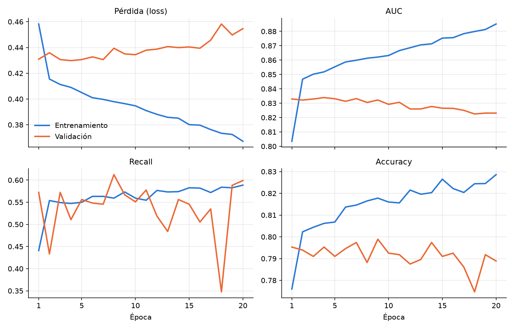

# 1. Datos y modelo

Cómo se prepararon los datos y se entrenó la red neuronal. El código completo, con sus resultados, está en [`notebooks/entrenamiento_modelo.ipynb`](../notebooks/entrenamiento_modelo.ipynb).

## El problema

Se usó el dataset [Telco Customer Churn](https://www.kaggle.com/datasets/blastchar/telco-customer-churn), descargado de Kaggle en formato CSV. Cada fila es un cliente y la columna `Churn` indica si se fue (`Yes`) o se quedó (`No`). Es, por tanto, un problema de **clasificación binaria**.

## Revisión de los datos

Primero se comprueba que el dataset esté completo:

```python
df.shape
df.head()
df.info()
df.isna().sum()
```

`df.info()` muestra que `TotalCharges` está como `object` (texto), cuando en el dataset es claramente un valor decimal. Se convierte a número, dejando como `NaN` los valores que no se puedan convertir:

```python
df['TotalCharges'] = pd.to_numeric(df['TotalCharges'], errors='coerce')
```

Quedan 11 filas con `NaN`. Como son muy pocas frente a las 7.043 del dataset, se eliminan:

```python
df = df.dropna()
```

## Variable objetivo y variables de entrada

Las redes neuronales solo trabajan con números, así que las variables categóricas hay que convertirlas. La variable objetivo se convierte directamente a 0 y 1:

```python
df['Churn'] = df['Churn'].map({'Yes': 1, 'No': 0})
```

Después se separan la variable objetivo y las variables de entrada. `customerID` se elimina porque es un identificador y no aporta información:

```python
X = df.drop('Churn', axis=1)
y = df['Churn']

X = X.drop('customerID', axis=1)
```

## Preprocesamiento

Para las variables categóricas se usa una transformación **one-hot**: se crea una columna por cada valor posible de la variable original, con un 1 en la columna que corresponde al valor del cliente y un 0 en las demás. Es un método recomendable cuando las variables tienen pocos valores posibles, y eso se comprueba así:

```python
X.select_dtypes(include='object').nunique().sort_values(ascending=False)
```

Ninguna variable categórica tiene más de cuatro valores distintos.

Las variables numéricas se estandarizan para que todas tengan una escala parecida.

Las dos transformaciones se definen como `Pipeline` y se agrupan en un `ColumnTransformer`:

```python
categorical_cols = X.select_dtypes(include='object').columns
numeric_cols = X.select_dtypes(include=['int64', 'float64']).columns

numerical_transformer = Pipeline(steps=[
    ('imputer', SimpleImputer(strategy='median')),         # Rellenar los NaN con la mediana
    ('scaler', StandardScaler())                           # Estandarizar los datos
])

categorical_transformer = Pipeline(steps=[
    ('imputer', SimpleImputer(strategy='most_frequent')),  # Rellenar los NaN con el valor más frecuente
    ('onehot', OneHotEncoder(handle_unknown='ignore'))     # Convertir las categorías en variables dummy
])

preprocessor = ColumnTransformer(
    transformers=[
        ('num', numerical_transformer, numeric_cols),
        ('cat', categorical_transformer, categorical_cols)
    ])
```

**Por qué un `ColumnTransformer`.** Al ajustarlo, aprende los parámetros necesarios para preprocesar los datos (medias, desviaciones, categorías). Esos parámetros quedan guardados en `preprocessor`, que se puede exportar y usar en producción para aplicar a los datos nuevos exactamente las mismas transformaciones que vio el modelo al entrenar.

## División en entrenamiento y prueba

```python
X_train, X_test, y_train, y_test = train_test_split(
    X, y, test_size=0.2, random_state=42, stratify=y
)
```

Se usa `stratify=y` porque la variable objetivo está desbalanceada (solo el 26,6 % de los clientes se va), y así ambas particiones conservan esa proporción.

El preprocesador aprende sus parámetros solo con los datos de entrenamiento (`fit_transform`) y después se aplica tal cual a los de prueba (`transform`):

```python
X_train_preprocessed = preprocessor.fit_transform(X_train)
X_test_preprocessed = preprocessor.transform(X_test)
```

Tras el preprocesamiento, cada cliente queda representado por 45 columnas.

## Modelo

Red neuronal densa con dos capas ocultas y una salida sigmoide, que devuelve la probabilidad de que el cliente se vaya. Tiene 5.057 parámetros.

```python
model = Sequential([
    Input(shape=(input_shape,)),
    Dense(64, activation='relu'),
    Dense(32, activation='relu'),
    Dense(output_shape, activation='sigmoid')
])

model.compile(
    optimizer='adam',
    loss='binary_crossentropy',
    metrics=[
        'accuracy',
        tf.keras.metrics.Precision(name='precision'),
        tf.keras.metrics.Recall(name='recall'),
        tf.keras.metrics.AUC(name='auc')
    ]
)
```

Se entrena durante 20 épocas, usando el conjunto de prueba como validación:

```python
modelo = model.fit(X_train_preprocessed, y_train,
                   validation_data=(X_test_preprocessed, y_test),
                   epochs=20, verbose=2)
```

## Resultados

Métricas del modelo guardado sobre los 1.407 clientes del conjunto de prueba:

| Métrica | Valor |
|---|---|
| Accuracy | 0,789 |
| Precisión | 0,604 |
| Recall | 0,599 |
| AUC | 0,823 |

De los 374 clientes que se fueron, el modelo detecta 224. A cambio, señala como riesgo a 147 clientes que se quedaron.



**Lectura de las curvas.** La pérdida de entrenamiento baja durante las 20 épocas, pero la de validación deja de mejorar hacia la época 4 y después sube. Lo mismo pasa con el AUC de validación, que alcanza su máximo (0,834) en la época 4 y termina en 0,823. El modelo empieza a sobreajustarse pronto: seguir entrenando solo mejora los resultados sobre los datos que ya conoce.

## Guardado

Se guardan el modelo y el preprocesador, que son los dos archivos que necesita la API:

```python
model.save("../modelo/churn_model")

import joblib
joblib.dump(preprocessor, "../modelo/preprocessor.pkl")
```

## Qué mejoraría

- **Parar antes.** Usar *early stopping* para quedarse con el modelo de la mejor época en lugar del de la última.
- **Separar validación y prueba.** El conjunto de prueba se usó también como validación durante el entrenamiento. Lo correcto es reservar un tercer conjunto que no se mire hasta el final.
- **Tratar el desbalance.** El modelo detecta el 60 % de las cancelaciones. Dar más peso a la clase minoritaria (`class_weight`) o bajar el umbral de decisión subiría el recall.
