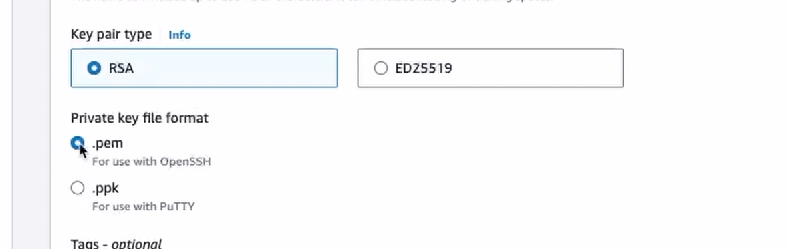
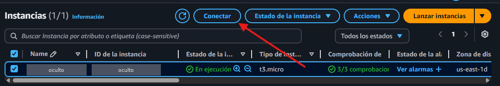
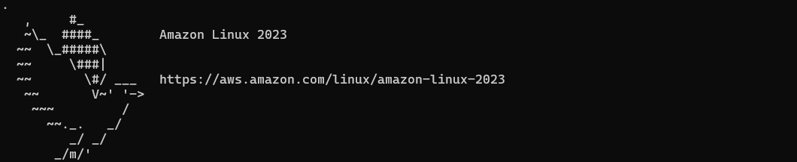
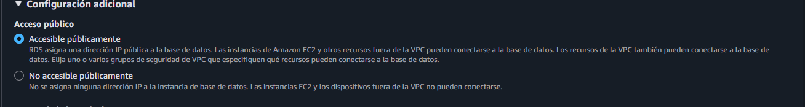
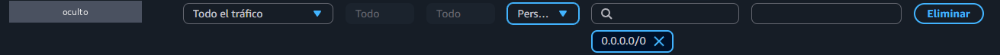
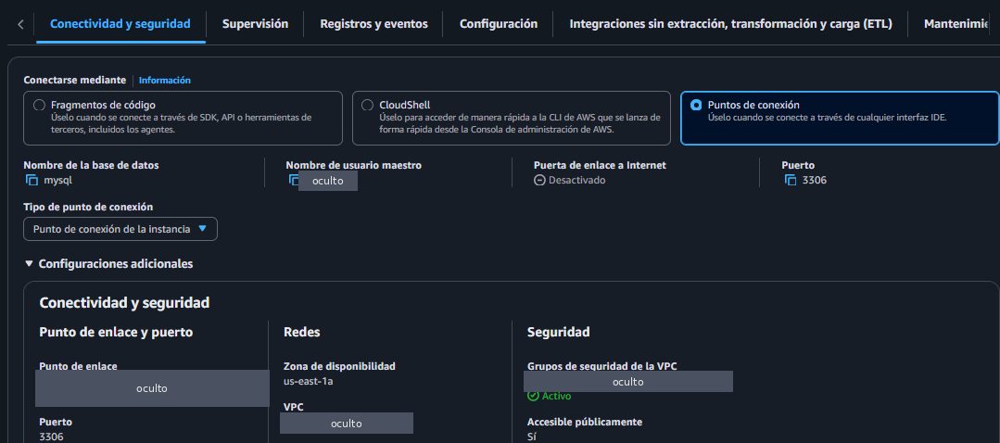
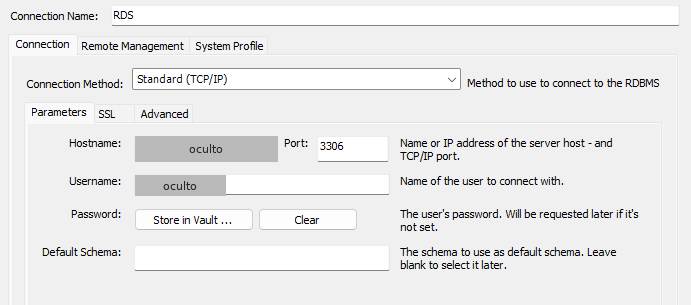

# 3. Despliegue en AWS

Cómo se llevó la API a la nube: la aplicación en una instancia **EC2** y la base de datos MySQL en **RDS**.

> **Datos reemplazados.** Los valores propios de la cuenta de AWS (IP pública, punto de enlace de la base de datos, usuario, contraseña, identificadores y rutas del computador) se cambiaron por marcadores como `<IP_PUBLICA_EC2>`. Las capturas tienen esos datos ocultos. Para repetir los pasos hay que usar los valores de la cuenta propia.

## Resumen

| Recurso | Configuración |
|---|---|
| EC2 | Instancia `t3.micro` (capa gratuita) con Amazon Linux 2023 |
| RDS | MySQL, con acceso público activado para poder conectarse desde MySQL Workbench |
| API | `api/app_sin_modelo.py`, servida con Uvicorn en el puerto 8000 |
| Credenciales | Variables de entorno en la instancia, nunca en el código |

**Limitación.** TensorFlow no se pudo instalar en la instancia de la capa gratuita, porque necesita más memoria de la que tiene. Por eso en AWS se desplegó la versión de la API que no carga el modelo y devuelve una probabilidad fija. Lo que quedó probado en la nube es el recorrido completo de una petición: llega a la API en EC2, se valida, se guarda en RDS y se devuelve la respuesta. La API con el modelo real (`api/app.py`) se ejecutó en local.

---

## Parte A: instancia EC2

### A1. Crear el par de llaves

En la consola de AWS se busca **EC2** y se crea un par de llaves, con tipo RSA y formato `.pem`:



Al crearlo se descarga un archivo `.pem`. Esa llave es la que permite entrar a la instancia y modificarla: solo quien tenga el archivo puede hacerlo.

> El archivo `.pem` nunca debe subirse a un repositorio. En este proyecto está excluido en `.gitignore`.

### A2. Crear la instancia

Al lanzar la instancia se define:

- **Nombre** de la instancia.
- **Imagen:** el sistema operativo que ejecutará (Amazon Linux 2023).
- **Tipo de instancia:** la capacidad de cómputo (`t3.micro`).
- **Par de llaves:** el creado en el paso anterior.
- **Grupo de seguridad:** qué tráfico puede entrar. Para la prueba se permitió SSH solo desde "My IP", de modo que nadie más pudiera conectarse.

Más adelante, al conectar la instancia con RDS, hubo que ampliar las reglas de entrada para permitir cualquier tipo de tráfico desde cualquier IPv4. Es algo que se puede ajustar mejor (ver la nota de seguridad de la parte B).

### A3. Conectarse por SSH

Se selecciona la instancia y se pulsa **Conectar**:



De las opciones que ofrece AWS se usa **Cliente SSH**, es decir, la terminal del computador. Desde la terminal se abre la carpeta donde está la llave:

```powershell
cd <carpeta-donde-está-la-llave>
ls
```

Y se ejecuta el comando que entrega AWS en la pestaña "Cliente SSH", que combina el nombre de la llave con la dirección de la instancia:

```powershell
ssh -i "<mi-llave>.pem" ec2-user@ec2-<IP-CON-GUIONES>.compute-1.amazonaws.com
```

La IP pública de la instancia cambia cada vez que se inicia, así que el comando hay que copiarlo de nuevo en cada sesión.

Si la conexión funciona, aparece el mensaje de bienvenida de Amazon Linux:



### A4. Preparar el sistema

Se actualiza el sistema y se comprueba que Python esté instalado:

```bash
sudo yum update -y
python3 --version
```

### A5. Copiar el proyecto a la instancia

Se sale de la instancia con `exit` y, desde la carpeta donde está la llave, se envía la carpeta del proyecto con `scp`:

```powershell
scp -i <mi-llave>.pem -r "<ruta-local>\api-prediccion-churn-aws" ec2-user@<IP_PUBLICA_EC2>:/home/ec2-user/
```

Aquí la IP se escribe con puntos. `/home/ec2-user/` es la carpeta de usuario que Linux crea automáticamente.

La primera vez, el comando pide confirmar la conexión: hay que escribir `yes`. A veces lo que se escribe no aparece en pantalla, pero sí se está registrando. Si el mensaje se repite, se vuelve a ejecutar el comando hasta que se vea la lista de archivos copiándose.

Después se entra de nuevo a la instancia y se comprueba que la carpeta esté:

```bash
ls
```

### A6. Problema de permisos y solución

Al intentar crear el entorno virtual dentro de la carpeta copiada, el sistema respondió `Permission denied`. Los permisos se revisan así:

```bash
ls -ld api-prediccion-churn-aws
```

```
dr-x------. 4 ec2-user ec2-user ... api-prediccion-churn-aws
```

`dr-x------` significa que el usuario puede leer la carpeta (`r`) y entrar en ella (`x`), pero no escribir (`w`). Por eso no se podía crear nada dentro. Se soluciona dando permiso de escritura:

```bash
sudo chmod -R u+w api-prediccion-churn-aws
```

Al revisar de nuevo, los permisos quedan como `drwx------`.

### A7. Entorno virtual y dependencias

Desde la carpeta del proyecto:

```bash
cd api-prediccion-churn-aws
python3 -m venv venv
source venv/bin/activate
```

Cuando el entorno está activo, la línea de la terminal empieza con `(venv)`.

Se actualiza `pip` y se instalan las librerías que necesita la API:

```bash
pip install --upgrade pip
pip install fastapi uvicorn pydantic numpy pandas scikit-learn joblib mysql-connector-python
pip install pymysql
```

También se instala el cliente de MySQL en la instancia (desde fuera de la carpeta del proyecto):

```bash
sudo dnf install mariadb105 -y
```

### A8. Credenciales como variables de entorno

El código original se conectaba a una base de datos local, con el usuario y la contraseña escritos en el propio archivo. Para conectarse a RDS no se recomienda hacerlo así: cualquiera con acceso a la instancia o al código vería las credenciales.

En su lugar, se definen como variables de entorno en la instancia:

```bash
export DB_HOST=<punto-de-enlace-de-rds>
export DB_USER=<usuario>
export DB_PASSWORD='<contraseña>'
export DB_NAME=<nombre-de-la-base-de-datos>
export DB_PORT=3306
```

Para comprobar que quedaron definidas:

```bash
echo $DB_HOST
```

Estas variables se pierden cada vez que se apaga la instancia, aunque hay formas de hacerlas permanentes.

En el código, la función de conexión lee esas variables con `os.getenv`:

```python
import pymysql
import os

def get_connection():
    return pymysql.connect(
        host=os.getenv("DB_HOST"),
        user=os.getenv("DB_USER"),
        password=os.getenv("DB_PASSWORD"),
        port=int(os.getenv("DB_PORT", "3306")),
        database=os.getenv("DB_NAME"),
        cursorclass=pymysql.cursors.DictCursor,
    )
```

En la instancia, este cambio se hizo editando el archivo con `nano` (se guarda con `Ctrl + O` y `Enter`, y se sale con `Ctrl + X`). En este repositorio, `api/app_sin_modelo.py` ya lo incluye.

### A9. Iniciar la API

```bash
cd api
uvicorn app_sin_modelo:app --host 0.0.0.0 --port 8000
```

`--host 0.0.0.0` hace que la API acepte peticiones desde fuera de la instancia. Para enviarle datos se abre en el navegador:

```
http://<IP_PUBLICA_EC2>:8000/docs
```

La API se detiene con `Ctrl + C`.

---

## Parte B: base de datos en RDS

### B1. Crear la base de datos

En la consola de AWS se busca **RDS** y se crea una base de datos MySQL. Para poder conectarse desde fuera de AWS (por ejemplo, desde MySQL Workbench en el computador), en la configuración adicional se activa el acceso público:



### B2. Grupo de seguridad

Para usar la base de datos desde MySQL Workbench se creó un grupo de seguridad nuevo (sin usar el `default`) con una regla de entrada que permite todo el tráfico desde cualquier dirección IPv4:



> **Nota de seguridad.** Esta regla deja la base de datos abierta a cualquier dirección de internet y solo es aceptable para una prueba corta. Lo adecuado es permitir únicamente el puerto 3306, y solo desde el grupo de seguridad de la instancia EC2 y desde la IP propia.

### B3. Conectarse desde MySQL Workbench

Para crear la conexión hacen falta el usuario maestro, la contraseña, el puerto y el punto de enlace. El puerto y el punto de enlace se consultan en la pestaña **Conectividad y seguridad** de la base de datos:



En Workbench, el punto de enlace va en *Hostname* y el usuario maestro en *Username*:



Desde ahí se puede consultar la tabla `predictions` y ver los registros que va guardando la API.

---

## Qué mejoraría

- **Servir el modelo real en la nube.** Usar una instancia con más memoria, o convertir el modelo a un formato ligero (TensorFlow Lite u ONNX) que no necesite instalar TensorFlow completo.
- **Cerrar la base de datos.** Quitar el acceso público de RDS y limitar el grupo de seguridad al tráfico de la instancia EC2.
- **Credenciales permanentes y seguras.** Guardarlas en AWS Secrets Manager o Parameter Store en lugar de definirlas a mano en cada sesión.
- **Empaquetar con Docker**, para que el entorno de la instancia sea igual al local.
