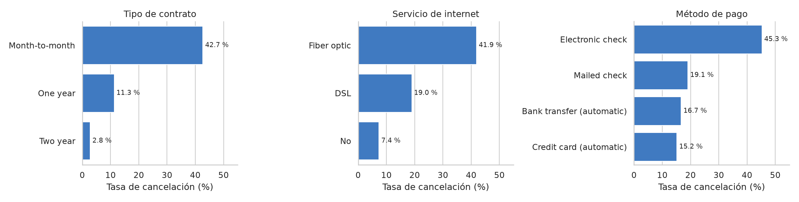
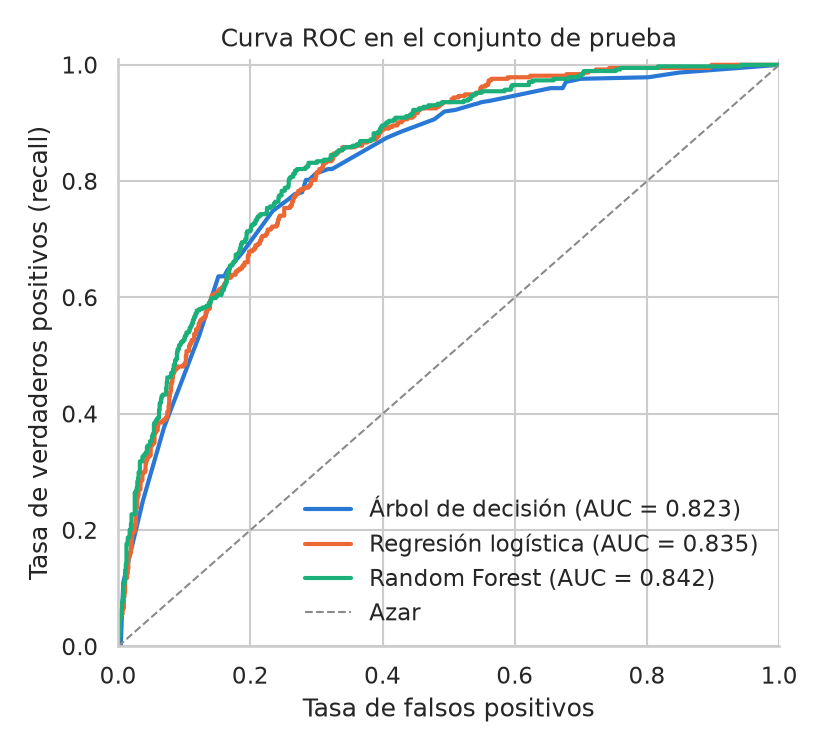
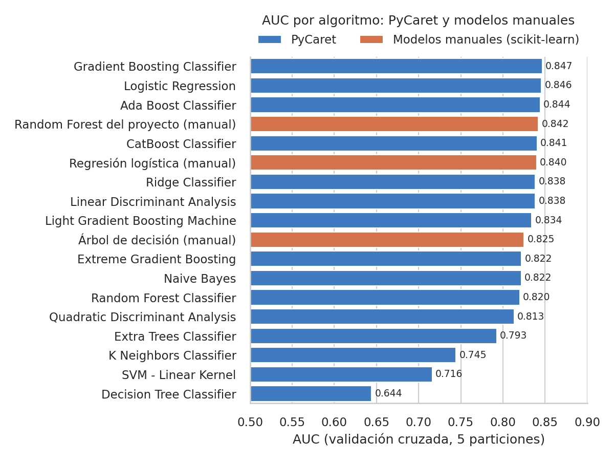
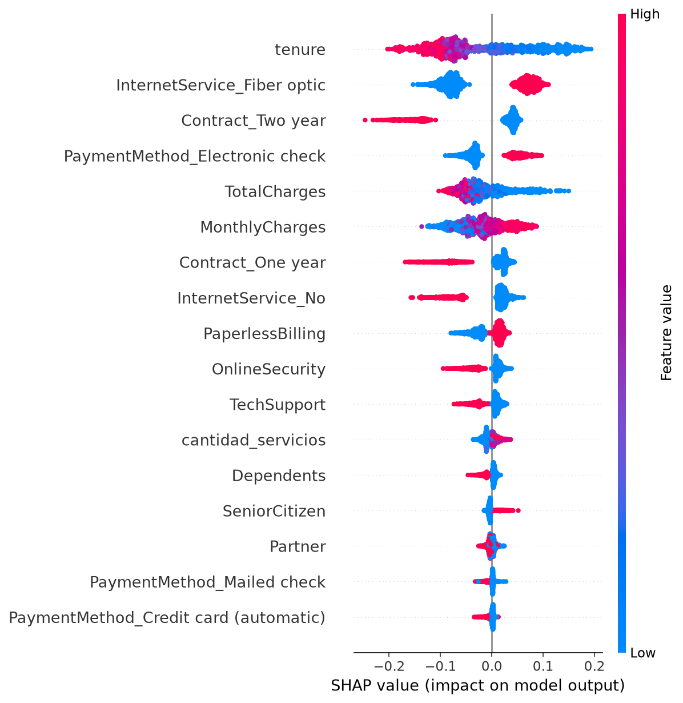
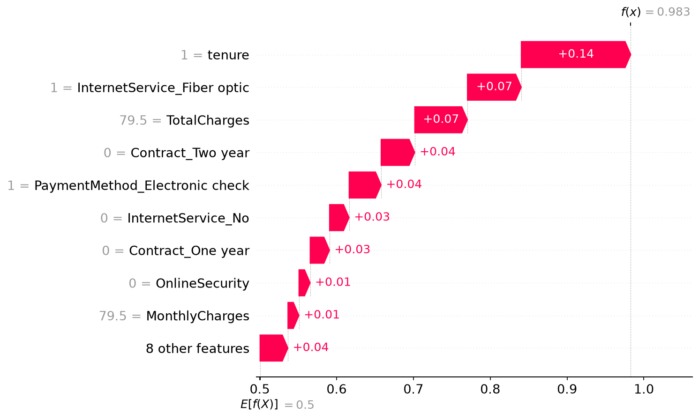

# Predicción de cancelación de clientes (churn) en telecomunicaciones

Proyecto de ciencia de datos de principio a fin sobre 7.043 clientes de una empresa de telecomunicaciones: análisis exploratorio, pipeline de preprocesamiento, comparación de modelos, modelo final y explicación de sus predicciones.

**Resultado:** un Random Forest que, sobre clientes que no vio durante el entrenamiento, detecta el 76 % de las cancelaciones con un ROC-AUC de 0,842, y que permite explicar cada predicción con SHAP.

| Aspecto | Detalle |
|---|---|
| **Problema** | Clasificación binaria con clases desbalanceadas (26,5 % de cancelaciones) |
| **Modelo final** | Random Forest dentro de un pipeline de scikit-learn con transformadores propios |
| **Validación** | Partición 80/20 estratificada y validación cruzada de 5 particiones |
| **Herramientas** | Python, pandas, scikit-learn, PyCaret, SHAP, matplotlib, seaborn |

## Contexto

Una empresa de telecomunicaciones pierde cerca de uno de cada cuatro clientes. Retener a un cliente cuesta menos que conseguir uno nuevo, así que interesa saber **qué clientes tienen más riesgo de irse y por qué**, para actuar antes de que cancelen.

Dejar pasar a un cliente que se va cuesta más que contactar a uno que no pensaba irse. Por eso los modelos se evalúan con recall, precisión y F1, y no con *accuracy*.

## Proceso

| Etapa | Qué se hizo | Dónde |
|---|---|---|
| 1. EDA | Calidad de datos, relación de cada variable con la cancelación (V de Cramér) y selección de variables | [`eda/eda.ipynb`](eda/eda.ipynb) |
| 2. Pipeline | Transformadores propios de limpieza, creación de variables y codificación, encadenados con el modelo | [`modelo/pipeline.ipynb`](modelo/pipeline.ipynb) |
| 3. Comparaciones | Árbol de decisión, regresión logística y Random Forest ajustados con la misma búsqueda; contraste con 15 algoritmos en PyCaret | [`comparaciones/`](comparaciones) |
| 4. Modelo final | Entrenamiento del Random Forest y guardado del pipeline | [`modelo/modelo.py`](modelo/modelo.py) |
| 5. Pruebas | Evaluación en el conjunto de prueba, predicción de un cliente nuevo y explicabilidad con SHAP | [`pruebas/evaluacion_shap.ipynb`](pruebas/evaluacion_shap.ipynb) |

## Qué dicen los datos

- **Contrato.** Cancela el 42,7 % de los clientes con contrato mes a mes, frente al 11,3 % con contrato de un año y el 2,8 % con contrato de dos años.
- **Antigüedad.** En el primer año cancela el 47,4 % de los clientes; después de cuatro años, el 9,5 %.
- **Internet y pago.** Los clientes de fibra óptica (41,9 %) y los que pagan con cheque electrónico (45,3 %) cancelan más del doble que el resto.
- El género y los servicios de telefonía no tienen relación con la cancelación.



## Comparación de modelos

Los tres modelos usan el mismo preprocesamiento y la misma partición, y cada uno se ajustó con una búsqueda en rejilla por F1. Resultados sobre los 1.409 clientes del conjunto de prueba:

| Modelo | ROC-AUC | F1 | Recall | Precisión | Precisión a recall 80 % |
|---|---|---|---|---|---|
| **Random Forest** (modelo final) | **0,842** | **0,631** | 0,762 | **0,538** | **0,529** |
| Regresión logística | 0,835 | 0,616 | 0,786 | 0,507 | 0,498 |
| Árbol de decisión | 0,823 | 0,620 | 0,802 | 0,505 | 0,505 |

- Random Forest es el mejor en ROC-AUC y F1, tanto en prueba como en validación cruzada.
- Con el umbral por defecto, el árbol detecta algo más de cancelaciones, pero con más falsas alarmas. Cuando se iguala el recall de los tres modelos, Random Forest es siempre el más preciso.
- Las diferencias son moderadas: la ventaja en F1 es de 1 a 2 centésimas.



### Contraste con PyCaret

Para comprobar que no se estaba dejando fuera un algoritmo mejor, se compararon 15 algoritmos con PyCaret. Ninguno supera con claridad al modelo elegido: el mejor (Gradient Boosting) alcanza un AUC de 0,847 en validación cruzada, frente a 0,842 del Random Forest del proyecto. Con estas variables, el techo de rendimiento está cerca de 0,85.



## Modelo final

De los 374 clientes del conjunto de prueba que cancelaron, el modelo detecta 285. A cambio, señala como riesgo a 245 clientes que no cancelaron.

| Métrica | Valor |
|---|---|
| ROC-AUC | 0,842 |
| Recall | 0,762 |
| Precisión | 0,538 |
| F1 | 0,631 |

## Por qué predice lo que predice

SHAP muestra cuánto sube o baja el riesgo cada característica del cliente. La antigüedad es la variable con más peso: los clientes recientes tienen más riesgo. Le siguen el internet por fibra óptica y el pago con cheque electrónico, que suben el riesgo, y el contrato de dos años, que lo baja. Coincide con lo observado en el EDA.



También se puede explicar cada predicción por separado. Este es el cliente de mayor riesgo del conjunto de prueba: un mes de antigüedad, fibra óptica, contrato mes a mes y pago con cheque electrónico.



## Decisiones técnicas

- **Todo el preprocesamiento vive dentro del pipeline.** Los transformadores de `transformadores.py` reciben los datos crudos y hacen la limpieza, la creación de variables y la codificación. El entrenamiento y la predicción ejecutan el mismo código, y no hay fuga de información entre entrenamiento y prueba.
- **Selección de variables con V de Cramér.** Se descartaron `gender`, `PhoneService` y `MultipleLines` por no tener relación con la cancelación, y cuatro servicios muy relacionados entre sí se resumieron en una sola variable, `cantidad_servicios`. PyCaret, usando todas las variables originales, llega al mismo rendimiento.
- **Clases balanceadas.** Los modelos se entrenan con `class_weight="balanced"` para no ignorar a la clase minoritaria.
- **Hiperparámetros ajustados por F1 y no por recall.** Un árbol de un solo nivel alcanza un recall de 0,97 marcando como riesgo a casi todos los clientes. F1 obliga a equilibrar recall y precisión.
- **El conjunto de prueba solo se usa al final.** El ajuste de hiperparámetros y la elección del modelo se hacen con validación cruzada sobre el conjunto de entrenamiento.

## Estructura del repositorio

```
├── data/
│   └── telco_churn.csv              Datos (7.043 clientes, 21 columnas)
├── eda/
│   └── eda.ipynb                    Análisis exploratorio y selección de variables
├── modelo/
│   ├── transformadores.py           Transformadores propios del pipeline
│   ├── pipeline.ipynb               Construcción del pipeline, paso a paso
│   ├── modelo.py                    Entrena el modelo final y lo guarda
│   └── pipeline_churn.pkl           Modelo final entrenado
├── pruebas/
│   └── evaluacion_shap.ipynb        Evaluación del modelo final y explicabilidad
├── comparaciones/
│   ├── comparacion_modelos.ipynb    Árbol, regresión logística y Random Forest
│   └── comparacion_pycaret.ipynb    15 algoritmos con PyCaret
├── img/                             Gráficos usados en este README
├── requirements.txt
└── requirements-pycaret.txt
```

## Cómo reproducirlo

Requiere Python 3.11 o superior.

```bash
python -m venv .venv
.venv\Scripts\activate          # En macOS o Linux: source .venv/bin/activate
pip install -r requirements.txt
```

Entrenar el modelo final:

```bash
python modelo/modelo.py
```

Los notebooks se ejecutan desde su propia carpeta, en el orden de la tabla de la sección Proceso.

PyCaret 3.3.2 solo funciona con Python 3.9 a 3.11 y con versiones de pandas y scikit-learn anteriores a las del resto del proyecto, así que `comparacion_pycaret.ipynb` se ejecuta en un entorno aparte:

```bash
conda create -n churn-pycaret python=3.11
conda activate churn-pycaret
pip install -r requirements-pycaret.txt
```

## Limitaciones y próximos pasos

- **Umbral de decisión.** Se usa el umbral por defecto (0,5). Habría que ajustarlo según cuánto cuesta contactar a un cliente frente a cuánto cuesta perderlo.
- **Probabilidades sin calibrar.** Al balancear las clases, el modelo sobrestima la frecuencia real de cancelación. Sus porcentajes sirven para ordenar y priorizar clientes, pero no son probabilidades calibradas.
- **Precisión.** Cerca de la mitad de los clientes que el modelo señala como riesgo no llega a cancelar.
- **Datos.** Son una foto fija. No incluyen reclamos, uso del servicio ni cambios de plan, que es probablemente lo que haría falta para superar el techo actual de rendimiento.

## Datos

[Telco Customer Churn](https://www.kaggle.com/datasets/blastchar/telco-customer-churn), conjunto de datos de ejemplo publicado por IBM y disponible en Kaggle.
