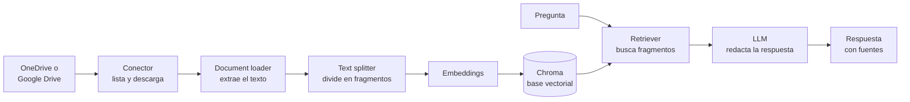

# Asistente RAG para OneDrive y Google Drive

Asistente que responde preguntas con base en los documentos de las carpetas de OneDrive o de Google Drive que tú definas, y cita de qué archivo salió cada respuesta.

Usa **RAG** (*Retrieval-Augmented Generation*): en lugar de pedirle al modelo que responda de memoria, primero se buscan los fragmentos de tus documentos más relacionados con la pregunta y se le entregan como contexto.

| Aspecto | Detalle |
|---|---|
| **Fuentes** | OneDrive (Microsoft Graph), Google Drive (Drive API) y carpetas locales |
| **Orquestación** | LangChain |
| **Modelo de lenguaje y embeddings** | IBM watsonx.ai |
| **Base vectorial** | Chroma, guardada en disco |
| **Interfaz** | Gradio |
| **Tipos de archivo** | PDF, Word (.docx), texto (.txt, .md), CSV y documentos de Google (Docs, Sheets, Slides) |

## Cómo funciona



1. **Sincronización.** El conector recorre las carpetas configuradas, incluidas sus subcarpetas, y descarga solo los archivos nuevos o modificados.
2. **Indexación.** Cada archivo se convierte en texto, se divide en fragmentos de 1.000 caracteres y cada fragmento se guarda en Chroma junto con su embedding y el archivo de origen.
3. **Consulta.** La pregunta se convierte en embedding, se recuperan los fragmentos más parecidos y el modelo redacta la respuesta usando solo ese contexto.

La sincronización es incremental: un registro (`manifest.json`) guarda la versión de cada archivo indexado. Si un archivo no cambió, no se vuelve a procesar; si se eliminó de la nube, sus fragmentos salen del índice.

## Estructura

```
├── app_onedrive.py            Asistente sobre carpetas de OneDrive
├── app_google_drive.py        Asistente sobre carpetas de Google Drive
├── app_local.py               Asistente sobre carpetas del computador
├── aplicacion.py              Arranque común: sincroniza y abre la interfaz
├── rag_core.py                Núcleo RAG: loader, splitter, embeddings, Chroma, retriever y cadena de QA
├── sincronizar.py             Sincronización incremental entre la nube y el índice
├── conector_onedrive.py       Inicio de sesión de Microsoft, listado y descarga
├── conector_google_drive.py   Inicio de sesión de Google, listado, descarga y exportación
├── conector_local.py          Lectura de carpetas locales
├── interfaz.py                Interfaz de Gradio
├── config.py                  Lectura de la configuración (.env)
├── tests/                     Pruebas con modelos y APIs simulados
├── .env.example               Variables de configuración
└── requirements.txt
```

`rag_core.py` tiene una función por etapa del flujo (`document_loader`, `text_splitter`, `watsonx_embedding`, `vector_database`, `retriever`, `retriever_qa`). Los conectores no saben nada de RAG: solo listan y descargan archivos, así que añadir otra fuente (SharePoint, Dropbox) es escribir un conector más.

## Instalación

Probado con Python 3.11.

```bash
python -m venv .venv
.venv\Scripts\activate          # En macOS o Linux: source .venv/bin/activate
pip install -r requirements.txt
```

Copia `.env.example` como `.env` y completa los valores.

## Configuración

### 1. IBM watsonx.ai

Se necesita una cuenta de IBM Cloud con un proyecto de watsonx.ai.

| Variable | Dónde se obtiene |
|---|---|
| `WATSONX_APIKEY` | IBM Cloud → Manage → Access (IAM) → API keys |
| `WATSONX_PROJECT_ID` | watsonx.ai → proyecto → pestaña Manage → General |
| `WATSONX_URL` | Depende de la región del proyecto (por defecto, Dallas) |

### 2. OneDrive

1. Registra una aplicación en el [centro de administración de Microsoft Entra](https://entra.microsoft.com) (Entra ID → App registrations → New registration), con el tipo de cuenta **Any Entra ID Tenant + Personal Microsoft accounts**.
2. En **Authentication**, añade la plataforma **Mobile and desktop applications** con la URI de redirección `http://localhost`.
3. En **API permissions**, añade el permiso delegado de Microsoft Graph **Files.Read**.
4. Copia el **Application (client) ID** en `ONEDRIVE_CLIENT_ID`.
5. Escribe en `ONEDRIVE_FOLDERS` las carpetas a indexar, desde la raíz de OneDrive y separadas por punto y coma.

### 3. Google Drive

1. En [Google Cloud Console](https://console.cloud.google.com), crea un proyecto y habilita **Google Drive API**.
2. En **Google Auth platform**, configura la pantalla de consentimiento con audiencia **External** y añade tu correo como usuario de prueba.
3. En **Clients**, crea un cliente de tipo **Desktop app**, descarga el JSON y guárdalo como `credentials.json` en la carpeta del proyecto.
4. Escribe en `GDRIVE_FOLDERS` el enlace o el id de cada carpeta, separados por punto y coma.

## Uso

```bash
python app_onedrive.py          # OneDrive       -> http://127.0.0.1:7860
python app_google_drive.py      # Google Drive   -> http://127.0.0.1:7861
python app_local.py             # Carpeta local  -> http://127.0.0.1:7862
```

La primera vez se abre el navegador para iniciar sesión y autorizar el acceso de solo lectura. Después, la aplicación sincroniza las carpetas, actualiza el índice y abre la interfaz.

| Opción | Efecto |
|---|---|
| `--sin-sincronizar` | Abre la interfaz sin revisar si hay archivos nuevos |
| `--solo-sincronizar` | Actualiza el índice y termina |
| `--reindexar` | Borra el índice y vuelve a indexar todo |

## Pruebas

```bash
pytest
```

Las 24 pruebas no necesitan internet ni credenciales: usan embeddings y un modelo de lenguaje simulados, y respuestas simuladas de las APIs de Microsoft y Google. Cubren la lectura de cada tipo de archivo, la sincronización incremental, la recuperación de fragmentos, el recorrido de carpetas con paginación y la exportación de documentos de Google.

## Seguridad y privacidad

- **Solo lectura.** Los conectores piden los permisos mínimos (`Files.Read` y `drive.readonly`): no pueden modificar ni borrar archivos.
- **Sin credenciales en el repositorio.** Las claves están en `.env`, y `credentials.json`, las sesiones guardadas y la carpeta `datos/` están en `.gitignore`.
- **Qué sale del computador.** El texto de los documentos se envía a IBM watsonx.ai para calcular los embeddings y redactar las respuestas. Con `EMBEDDING_PROVIDER=huggingface` los embeddings se calculan en local, pero los fragmentos recuperados se siguen enviando al modelo de lenguaje.

## Limitaciones

- No lee archivos escaneados (sin texto), imágenes, Excel ni PowerPoint.
- De una hoja de cálculo de Google solo se exporta la primera hoja.
- Está pensado para una sola persona: usa su sesión y no aplica permisos por usuario.
- Las preguntas que requieren recorrer todos los documentos ("¿cuántos contratos hay?") no se resuelven bien recuperando unos pocos fragmentos.

## Origen

El flujo RAG sigue el enfoque de los laboratorios de los cursos de IBM *Fundamentos de los agentes de IA mediante RAG y LangChain* y *Proyecto: aplicaciones de IA generativa con RAG y LangChain*. Sobre esa base se añadieron los conectores a la nube, la sincronización incremental, el índice persistente y las citas de las fuentes.
